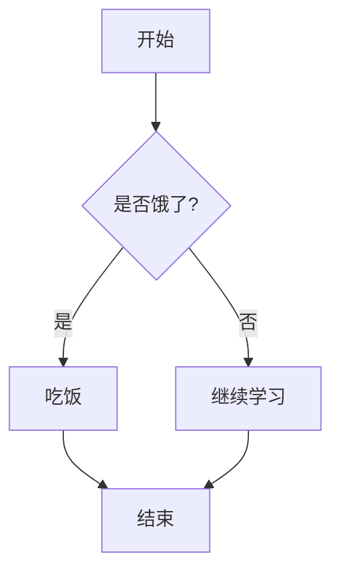
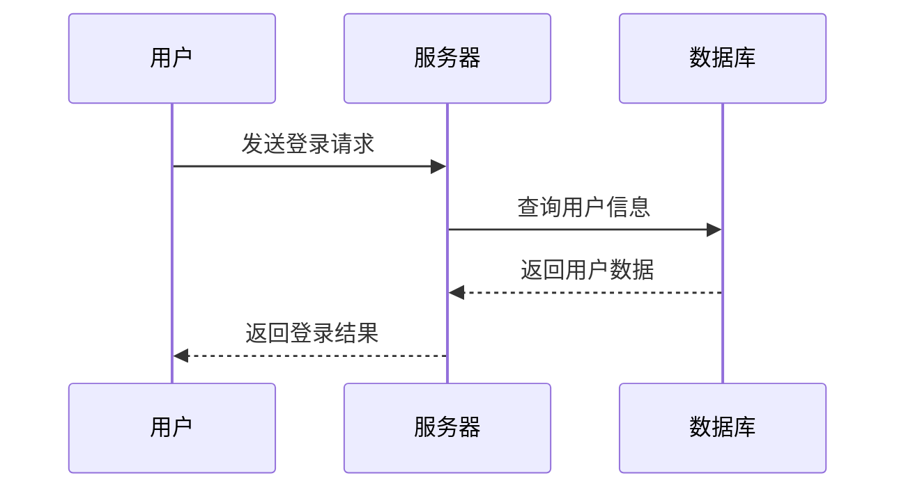
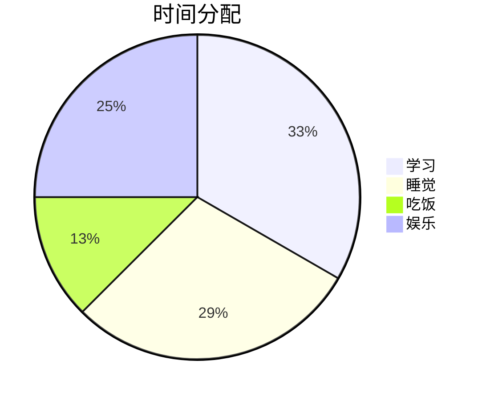
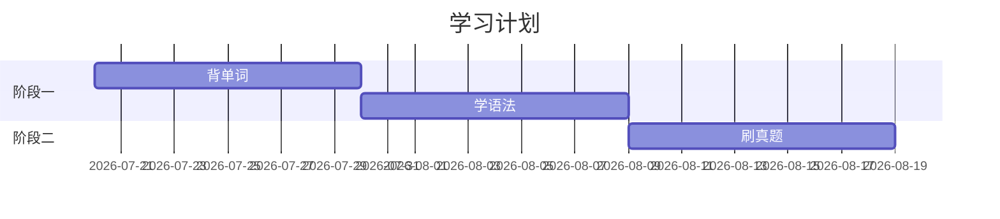
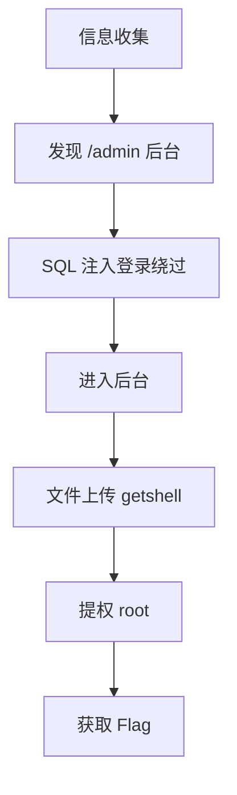
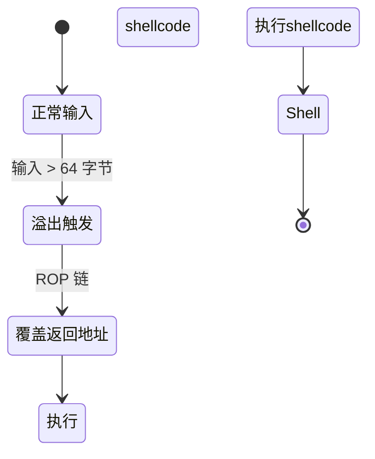
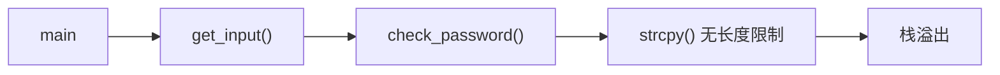

[TOC]


# Typora 完全使用指南 · 从零开始

> 你可能听说过"Markdown"这个词，但不太清楚它到底是什么，也不确定 Typora 能干嘛。
>
> **一句话解释：** Typora 是一个让你像写 Word 一样轻松写文章的工具——但你写的实际上是"Markdown 代码"，可以一键导出成精美的 PDF、HTML、Word 文档。
>
> 这篇指南从零开始，把我能想到的 Typora 使用方法全部教给你。

---

## 一、Typora 是什么？为什么要用？

### 先理解 Markdown

Markdown 是一种"标记语言"——你在文字前后加一些简单的符号（比如 `#` `**`），就能控制文字的格式。和 Word 不同的是：

- **Word：** 先打字，然后用鼠标选菜单 → 加粗/改字号/加底色
- **Markdown：** 打字时在文字前后直接打符号 → 预览时自动变成格式

**优点：**

1. 不需要鼠标，手不离开键盘就能排版
2. 文件是纯文本（`.md`），体积小，任何编辑器都能打开
3. 导出成 PDF / HTML / Word 非常方便
4. 程序员圈子的通用语言——笔记、文档、博客都用 Markdown

### Typora 的特殊之处

大部分 Markdown 编辑器是"分屏模式"——左边写源码，右边看效果。**Typora 是实时预览**：你打完符号，按回车，它立刻变成最终效果。所见即所得，对新手极度友好。

---

## 二、所有 Markdown 语法（完整版）

> 下面每一条语法，打开 Typora 直接照着敲，立刻就能看到效果。

### 2.1 标题

```markdown
# 一级标题（最大）
## 二级标题
### 三级标题
#### 四级标题
##### 五级标题
###### 六级标题（最小）
```

**效果：** Typora 中一级标题最大最粗，六级标题最小。标题左侧会自动出现折叠箭头，点击可以折叠该标题下的所有内容。

**快捷键：** `Ctrl+1` ~ `Ctrl+6` 分别对应一到六级标题。

**实用技巧：** 用标题给文章分层级——大标题是一级，章节是二级，小节是三级。

---

### 2.2 文字样式

```markdown
**这是加粗文字**
*这是斜体文字*
~~这是删除线文字~~
==这是高亮文字==
`这是行内代码`
<u>这是下划线</u>
```

**效果：**
- 加粗：**这是加粗文字**（强调重点）
- 斜体：*这是斜体文字*（引用/书名/外语词）
- 删除线：~~这是删除线文字~~（表示作废/吐槽）
- 高亮：==这是高亮文字==（标记关键词，Typora 特色语法）
- 行内代码：`这是行内代码`（技术类文章中引用命令/函数名）
- 下划线：<u>这是下划线</u>

**快捷键：**
- `Ctrl+B` 加粗
- `Ctrl+I` 斜体
- `Alt+Shift+5` 删除线（注意：不是 `Ctrl+D`）

---

### 2.3 代码块

````markdown
```python
# 这是 Python 代码块
def hello():
    print("Hello, World!")
    return True
```
````

**效果：** Typora 会自动识别语言并高亮关键词。超过 20 行的代码块会显示滚动条。

**快捷键：** `Ctrl+Shift+K` 插入代码块，或输入 ` ``` ` 然后按回车。

**改变语言：** 在代码块右下角点击语言名即可切换（Python / C / Java / JavaScript / HTML / Bash 等都支持）。

---

### 2.4 引用

```markdown
> 这是一级引用
>> 这是二级引用（嵌套）
>>> 这是三级引用
```

**效果：** 文字左侧出现灰色竖线和灰色文字。适合引用他人的话、引用古诗词、写"提示"和"注意"块。

**实用模板：**

```markdown
> **提示：** 这是一个重要的提示信息。

> **⚠ 注意：** 这是一个警告/注意事项。
```

---

### 2.5 列表

#### 无序列表

```markdown
- 项目一
- 项目二
  - 子项目 2.1（前面加两个空格）
  - 子项目 2.2
- 项目三
```

**效果：** 每项前面出现圆点。`Tab` 键缩进产生子列表，`Shift+Tab` 撤销缩进。

#### 有序列表

```markdown
1. 第一步
2. 第二步
   1. 子步骤 2.1
   2. 子步骤 2.2
3. 第三步
```

**效果：** Typora 自动递增序号——你只需要写 `1.`，它会自动变成 `2.` `3.`。

#### 任务列表

```markdown
- [ ] 未完成的任务
- [x] 已完成的任务
- [ ] 另一个未完成的
```

**效果：** 出现一个可以点击勾选的复选框。非常适合做 TODO 清单。

---

### 2.6 表格

```markdown
| 姓名 | 年龄 | 班级 |
|------|------|------|
| 小明 | 18   | 3班  |
| 小红 | 17   | 5班  |
| 小刚 | 19   | 2班  |
```

**效果：** Typora 自动对齐表格列，表头加粗显示。

**快捷键：** `Ctrl+T` 弹窗输入行数和列数，快速插入表格。

**技巧：**

- 在表格中按 `Tab` 跳到下一个单元格
- 在表格左上角点击可以选中整行/整列
- 右键表格 → 插入行/删除行/复制表格

---

### 2.7 链接和图片

#### 链接

```markdown
[点击访问百度](https://www.baidu.com)
```

**效果：** 显示为蓝色可点击文字。按住 `Ctrl` 点击即可在浏览器打开。

#### 引用式链接（适合重复使用）

```markdown
[百度][1] 和 [谷歌][2]

[1]: https://www.baidu.com
[2]: https://www.google.com
```

#### 图片

```markdown

```

**快捷键：** `Ctrl+Shift+I` 插入图片。

**Typora 特色功能：** 直接**从文件夹拖入**图片到 Typora，它会自动把图片复制到当前 `.md` 文件同目录下的 `assets/` 文件夹中（需要在偏好设置中开启"复制图片到 ./assets 文件夹"）。

---

### 2.8 分割线

```markdown
---
```

**效果：** 一条横线横跨整个页面宽度，用于分隔文章段落。

---

### 2.9 脚注

```markdown
这是一段文字，包含一个脚注[^1]。

[^1]: 这是脚注的内容，会出现在文章末尾。
```

**效果：** 正文中 `[^1]` 处出现上标数字，鼠标悬停显示脚注内容，文章底部自动汇总所有脚注。

---

### 2.10 数学公式

#### 行内公式

```markdown
爱因斯坦的质能方程：$E=mc^2$
```

**效果：** `$...$` 内的内容渲染为数学公式，嵌入到文字中。

#### 块公式

```markdown
$$
f(x) = \frac{1}{\sqrt{2\pi}\sigma} e^{-\frac{(x-\mu)^2}{2\sigma^2}}
$$
```

**效果：** 公式居中、放大显示。支持 LaTeX 数学语法。

**常用数学符号速查：**

| 写法 | 效果 | 含义 |
|------|------|------|
| `\frac{a}{b}` | a/b | 分数 |
| `\sqrt{x}` | 根号 x | 平方根 |
| `\sum_{i=1}^{n}` | 求和符号 | 求和 |
| `\int_{a}^{b}` | 积分符号 | 定积分 |
| `\infty` | 无穷大 | 无穷 |
| `\alpha \beta \gamma` | 希腊字母 | alpha/beta/gamma |
| `\times` | 乘号 | 乘法 |
| `\cdot` | 点乘 | 点乘 |
| `\geq` `\leq` | 大于等于/小于等于 | 不等式 |
| `\neq` | 不等于 | 不等 |

---

### 2.11 目录（TOC）

```markdown
[TOC]
```

**效果：** 自动生成文章目录——它会扫描所有标题（`#` ~ `######`），生成层级化目录列表。点击目录中的任意条目，自动跳转到对应位置。

**注意：** `[TOC]` 必须单独放在一行。

---

### 2.12 Mermaid 图表

Typora 内置支持 **Mermaid**——一种用文字描述图表的语言。不需要画图工具！


#### 流程图

````markdown

````

**效果：** 自动渲染为流程图，有方框、菱形判断框、箭头。

#### 时序图

````markdown

````

**效果：** 显示各个参与方之间的交互顺序，非常适合描述网络协议、API 请求过程。

#### 饼图

````markdown

````

#### 甘特图（时间规划）

````markdown

````

---

### 2.13 Emoji

```markdown
:smile: :laughing: :+1: :heart: :star: :warning:
```

**效果：** 输入 `:smile:` 按回车后变成 😄，`:heart:` 变成 ❤️。

**常用 Emoji：**

- `:smile:` 😄 `:cry:` 😢 `:angry:` 😠
- `:+1:` 👍 `:-1:` 👎 `:clap:` 👏
- `:heart:` ❤️ `:star:` ⭐ `:fire:` 🔥
- `:warning:` ⚠ `:bulb:` 💡 `:rocket:` 🚀
- `:book:` 📖 `:computer:` 💻 `:lock:` 🔒

---

### 2.14 HTML 标签

Typora 支持在 Markdown 中直接写 HTML：

```markdown
<details>
<summary>点击展开详情</summary>

这里是被隐藏的内容，支持任何 Markdown 语法。

- 列表项 1
- 列表项 2

</details>
```

**效果：** 出现一个可折叠的区域，点击箭头展开/收起内容。

**其他常用 HTML：**

```html
<center>居中文字</center>
<span style="color:red;">红色文字</span>
<kbd>Ctrl</kbd> + <kbd>C</kbd>   <!-- 键盘按键样式 -->
<br>  <!-- 强制换行 -->
```

---

## 三、Typora 专属功能

### 3.1 实时预览

Typora 默认就是"所见即所得"模式——你打 `#`，它立刻显示成标题样式，而不是显示 `#` 字符。

**切换源码模式：** 按 `Ctrl+/` 可以在"预览模式"和"源码模式"之间切换。源码模式会显示所有 Markdown 符号，方便你检查格式。

### 3.2 大纲 / 侧边栏

- 点击左下角"大纲"按钮，右侧出现文章标题的层级结构
- 点击大纲中的任意标题，自动跳转
- 大纲就是"文档地图"——长文档必备

### 3.3 文件管理（侧边栏文件夹视图）

- 点击左下角"文件"按钮，左侧出现文件浏览器
- 在这里可以看到当前文件夹下的所有 `.md` 文件
- 右键可以新建文件/文件夹、重命名、删除
- 支持拖拽文件到不同文件夹

**最佳实践：** 打开一个项目文件夹（比如 `学习资料集成`），左侧显示所有文件，点击即可切换。非常适合管理学习笔记。

### 3.4 导出功能

点击菜单"文件 → 导出"，支持导出为：
- **PDF** — 最常用，排版完美，适合打印和分享
- **HTML** — 网页格式，可以在浏览器打开
- **Word (.docx)** — 与 Office 兼容
- **图片** — 导出为 PNG 图片
- **Epub / LaTeX** — 电子书和学术格式

> 导出 PDF 前建议先选一个好看的主题（比如 "Newsprint" 或 "Pixyll"）。

### 3.5 主题切换

点击菜单"主题"，可以看到内置主题列表：
- **Github** — 简洁白色，像 GitHub 的文章
- **Newsprint** — 仿报纸风格，适合打印
- **Night** — 深色背景，夜间护眼
- **Pixyll** — 优雅简洁

更多的主题可以去 [Typora Themes](https://theme.typora.io/) 下载，放到 Typora 的主题文件夹即可。

### 3.6 图片处理

**拖入图片自动复制：** 建议在 `文件 → 偏好设置 → 图像` 中设置：

- "插入图片时" → 选择"复制图片到 ./assets 文件夹"
- 这样 `.md` 文件和图片分离，打包分享时不会丢图

**图片缩放（Typora 特色）：** 在图片上右键 → 缩放，可以拖动调整图片大小。或直接拖拽图片四角。

---

## 四、CTF 与学习笔记最佳实践

### 4.1 学习笔记模板

```markdown
# [主题名称] 学习笔记

> 学习日期：2026-07-20
> 学习时长：2 小时
> 学习来源：[书名/视频链接]

---

## 核心概念

| 概念 | 解释 | 举例 |
|------|------|------|
| [概念1] | [一句话解释] | [例子] |
| [概念2] | [一句话解释] | [例子] |

---

## 重点内容

### 1. [小标题]

[详细笔记内容]

> **关键点：** [最重要的结论/公式]

---

### 2. [小标题]

[详细笔记内容]

---

## 总结

- [ ] 已掌握：[列出会的]
- [ ] 待复习：[列出还不会的]
- [ ] 下一步：[接下来的学习计划]

---

## 参考资料

1. [资料名](链接)
2. [资料名](链接)
```

---

### 4.2 CTF Writeup 模板

```markdown
# [CTF 名称] - [题目名] Writeup

| 项目 | 信息 |
|------|------|
| 比赛 | [比赛名称] |
| 题目 | [题目名称] |
| 分类 | Web / PWN / RE / Crypto / MISC |
| 难度 | ⭐⭐ |
| 工具 | [用到的工具] |
| 时间 | 2026-07-20 |

---

## 题目描述

> [题目给出的描述/提示]

---

## 解题过程

### 第一步：信息收集

[看到了什么，发现了什么线索]

```bash
# 用到的命令
nmap -sV target.com
```

### 第二步：分析漏洞

[漏洞在哪，怎么发现的]

### 第三步：构造 Payload

```python
# exp 代码
import requests
...
```

### 第四步：拿到 Flag

```
flag{xxxxxxxxxxxxx}
```

---

## 总结

- 考点：[这道题考了什么知识点]
- 收获：[学会了什么]
- 踩坑：[做错的、卡住的地方]
```

---

### 4.3 代码分析笔记模板

```markdown
# [程序名] 逆向分析笔记

## 基本信息

- 文件：[xxx.exe / xxx.elf / xxx.apk]
- 架构：x86 / x64 / ARM / MIPS
- 保护：ASLR / NX / Canary / PIE
- 工具：IDA Pro / Ghidra / x64dbg

---

## 关键函数

### main() @ 0x401000

```c
// 反编译结果
int main() {
    ...
}
```

**分析：** [这个函数做了什么]

---

## 漏洞分析

### 漏洞点：sub_402000 @ 0x402000

**漏洞类型：** 栈溢出 / 格式化字符串 / UAF / ...

**触发条件：** [怎么触发漏洞]

```python
# POC
payload = b"A" * 0x40 + p64(0xdeadbeef)
```

---

## 利用思路

```markdown
graph TD
    A[输入超长数据] --> B[覆盖返回地址]
    B --> C[ROP 链执行 system('/bin/sh')]
    C --> D[获得 Shell]
```
```markdown

### 4.4 用 Mermaid 画攻击链/漏洞流程图
**Web 攻击链示例：**

````markdown

````markdown

**漏洞利用状态机：**

````markdown

````

**逆向分析关键函数调用链：**

````markdown

````

---

### 4.5 用表格整理对比信息

**漏洞对比表：**

```markdown
| 漏洞 | 危害 | 利用难度 | 常见场景 | 防御 |
|------|------|---------|---------|------|
| SQL 注入 | 极高 | 低 | 登录框/搜索栏 | 参数化查询 |
| XSS | 中 | 低 | 留言板/评论区 | 输出编码 |
| CSRF | 中 | 中 | 修改密码/转账 | CSRF Token |
| SSRF | 高 | 中 | 文件导入/URL获取 | 白名单 |
| 文件上传 | 极高 | 低 | 头像/附件 | 类型白名单 |
```

**工具对比表：**

```markdown
| 工具 | 用途 | 命令示例 | 学习难度 |
|------|------|---------|---------|
| nmap | 端口扫描 | `nmap -sV target` | ⭐ |
| Burp Suite | Web 测试 | 拦截/改包 | ⭐⭐ |
| sqlmap | SQL 注入 | `sqlmap -u URL` | ⭐ |
| IDA Pro | 逆向分析 | 静态反编译 | ⭐⭐⭐⭐ |
| GDB | 动态调试 | `gdb ./binary` | ⭐⭐⭐ |
```

---

## 五、快捷键速查表

| 分类 | 快捷键 | 功能 |
|------|--------|------|
| **样式** | `Ctrl+B` | 加粗 |
|  | `Ctrl+I` | 斜体 |
|  | `Ctrl+U` | 下划线 |
|  | `Alt+Shift+5` | 删除线 |
|  | `Ctrl+Shift+` ` | 行内代码 |
| **段落** | `Ctrl+1` ~ `6` | 一到六级标题 |
|  | `Ctrl+Shift+K` | 插入代码块 |
|  | `Ctrl+Shift+Q` | 引用 |
|  | `Ctrl+Shift+]` | 增加缩进 |
|  | `Ctrl+Shift+[` | 减少缩进 |
| **列表** | `Ctrl+Shift+]` | 无序列表 |
|  | `Ctrl+Shift+[` | 有序列表 |
| **插入** | `Ctrl+Shift+I` | 插入图片 |
|  | `Ctrl+K` | 插入链接 |
|  | `Ctrl+T` | 插入表格 |
|  | `Ctrl+Shift+X` | 任务列表 |
|  | `---` + 回车 | 分割线 |
| **其他** | `Ctrl+/` | 源码模式切换 |
|  | `Ctrl+P` | 快速跳转文件 |
|  | `Ctrl+Shift+F` | 全局搜索 |
|  | `Ctrl+F` | 当前文档搜索 |
|  | `Ctrl+H` | 查找替换 |
|  | `Ctrl+Z` | 撤销 |
|  | `Ctrl+Y` | 重做 |
|  | `Ctrl+S` | 保存 |
|  | `F8` | 专注模式（只显示当前段落） |
|  | `F9` | 打字机模式（光标固定中间） |
|  | `F11` | 全屏模式 |
|  | `Ctrl+Shift+L` | 显示/隐藏侧边栏 |

---

## 六、给初学者的练习

建议按照以下顺序练习，每个花 5 分钟，30 分钟就能上手 Typora：

1. 创建一个新文件，写上 `# 我的第一个 Markdown 文档`
2. 添加一个 `[TOC]` 目录
3. 写三个二级标题（`## 学习笔记` `## CTF Writeup` `## 日常记录`）
4. 在每个二级标题下写一个无序列表
5. 插入一个表格（3 列 3 行）
6. 插入一段 ` ```python ` 代码块
7. 插入一张图片（直接拖入）
8. 按 `Ctrl+/` 切换到源码模式看看背后的代码
9. 导出为 PDF 看看效果
10. 恭喜你——你已经会用 Typora 了！

---

> **最后建议：** 把这篇指南存到 Typora 里打开，一边看一边敲——动手试一次比看十遍都管用。
